Synthetic Stock Returns
================
Lindsey Dorson
2022-10-17

``` r
library(quantmod)
library(tidyr)
library(dplyr)
library(fGarch)
library(Ecdat)
library(sn)
library(MASS)
library(LambertW)
library(stats)
library(ks)
library(htmlTable)
library(copula)
```

# 1. Intro

For this project, monthly log returns of stock prices from BlackRock
(BLK) and Goldman Sachs (GS) were analyzed from the past ten years. The
adjusted closing price was used to calculate the monthly log returns to
account for any corporate actions within each company. The purpose of
this project is to create synthetic returns that mimic the statistical
properties of the original monthly returns. This is created utilizing
each company’s individual returns and their relationship to each other.
The exact statistical analysis will be provided further down.

BlackRock and Goldman Sachs are both global financial institutions that
offer a variety of financial services. BlackRock is considered to be the
world’s largest asset manager while Goldman Sachs is considered a
superior investment bank. It is also important to note that Goldman
Sachs (founded in 1869) has been around for over 100 years and BlackRock
(founded in 1988) is fairly newer in comparison. However, since they
both cater to the same industry I would say their stock performance
could be fairly related. Also, Goldman Sachs does have an asset
management business that rivals BlackRock. Therefore, their monthly log
returns should have some sort of relationship.

*Download monthly stock prices for both ‘BLK’ and ‘GS’ from Yahoo
Finance. Select and transform adjusted prices into log returns. Note:
Time series format from initial download was removed as well.*

``` r
getSymbols("BLK;GS",
           from = "2012/08/01",
           to = "2022/10/01",
           periodicity = "monthly")
```

    ## [1] "BLK" "GS"

``` r
BLK_adj<-diff(log(BLK$BLK.Adjusted))
BLK_adj<-BLK_adj[-1,] 
BLK_adj<-data.frame(BLK_adj)
x1 <- BLK_adj$BLK.Adjusted

GS_adj <-diff(log(GS$GS.Adjusted))
GS_adj<-GS_adj[-1,]
GS_adj<-data.frame(GS_adj)
x2 <- GS_adj$GS.Adjusted
```

### a. Preliminary Analysis

``` r
BLK_hist<-hist(x1,main = "BlackRock Log Returns", col = "#00AFBB")
```

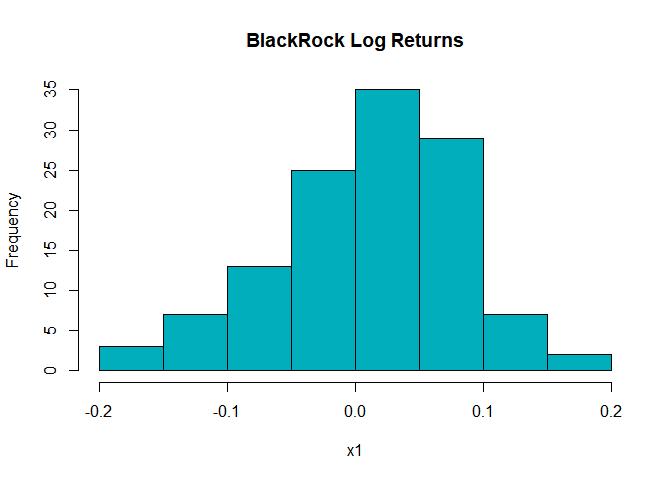<!-- -->

``` r
BLK_density<-plot(density(x1),lwd = 2,"Density Plot of Log Returns") + polygon(density(x1), col = "#00AFBB")
```

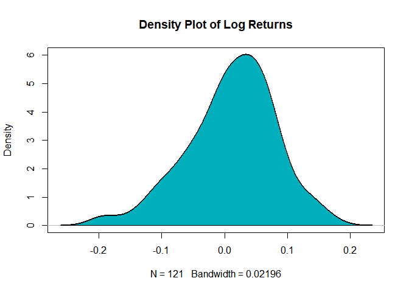<!-- -->

``` r
GS_hist<-hist(x2,main = "Goldman Sachs Log Returns", col = "#E7B800")
```

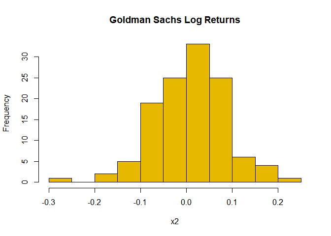<!-- -->

``` r
GS_density<-plot(density(x2),lwd = 2,"Density Plot of Log Returns") + polygon(density(x2), col = "#E7B800")
```

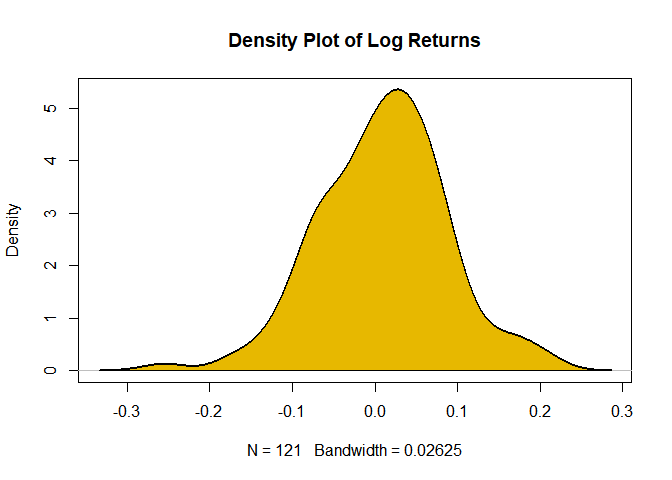<!-- -->

The histograms and density plots of each company indicate that both
returns are not perfectly symmetric and suffer from some slight degree
of left skewness which is expected. I would predict that a skewed
distribution would match their returns better.

# 2. Statistical Analysis

To create synthetic returns we first have to find the best fitting
distribution model for each company’s marginal distributions. This is
done by fitting the returns to the Normal, Skewed Normal, Student’s T,
and Skewed Student’s T distributions using a log-likelihood optimization
method. From this we can find the optimal parameters specific to each
type of distribution. To determine which distribution fits the returns
best, Akaike’s Information Criteria (AIC) and Bayesian Information
Criteria (BIC) estimates are compared to analyze each distributions
strength . The distribution that has the lowest value of AIC will be
selected (AIC is better for predication). Visualizations of the fittings
are added below as well to validate the selection. From the results
below ([Table 1.](#table-1.), [Table 2.](#table-2.)), the best fitting
distribution for both BlackRock and Goldman Sachs is the Skewed Student
T distribution.

Next, we take the optimized parameters ([Table 3.](#table-3.)) from the
Skewed Student T distribution to transform both stocks original monthly
returns into uniform marginal distributions ([Uniform Distribution
Figures](#uniform-distribution-figures)). This is to set up the modeling
of a copula which is used to describe the dependence between random
variables. Several copulas are fitted and analyzed. To be specific the
Gaussian, T, Frank, Joe, and Gumbel Copulas are used. The AIC is used
again to select the copula which gives the best representation of the
stocks relationship. [Table 5.](#table-5.) indicates that the frank
copula was the best fit. Now we can use the frank copula to extract and
mimic the marginal distribtions by randomly drawing a sample size equal
to the original monthly log returns. This sample data (cdf) is synthetic
and is then transformed back into a fitted Skewed Student T distribution
for comparison to the original returns. The simulated returns should be
close to the actual data if the stocks have joint dependence.

## a. Marginals

### <u>BlackRock:</u>

#### *Normal Distribution*

``` r
## Fitting normal distribution to returns
BLK_n <- fitdistr(x1,"normal")
BLK_para_n <- BLK_n$estimate
## calculating AIC & BIC
AIC_BLK_n <- 2*(2)-(2*(BLK_n$loglik))
BIC_BLK_n <- -2*(BLK_n$loglik)+(log(length(x1))*2)
```

``` r
x = seq(-20,20,by=0.01 )
plot(density(x1),lwd =2, main = "Normal Distribution", col = "black")
lines(x,dnorm(x,mean = BLK_para_n[1],sd = BLK_para_n[2]),lwd = 2,lty = 2,col="red")
legend(x = "topright",legend = c("Fitted","Original"),col=c("red","black"), lty = c(2,1))
```

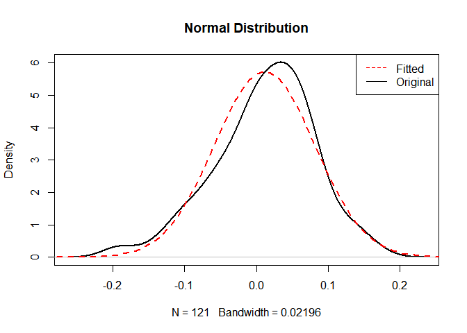<!-- -->

#### *Skewed Normal Distribution*

``` r
BLK_sn <- snormFit(x1)
BLK_para_sn <- BLK_sn$par

AIC_BLK_sn <- 2*(2)-(2*(-BLK_sn$objective))
BIC_BLK_sn <- -2*(-BLK_sn$objective)+(log(length(x1))*2)
```

``` r
plot(density(x1),lwd =2, main = "Skewed Normal Distibution", col = "black")
lines(x,dsnorm(x,mean = BLK_para_sn[1],sd = BLK_para_sn[2],xi = BLK_para_sn[3]),lwd = 2,lty = 2,col="red")
legend(x = "topright",legend = c("Fitted","Original"),col=c("red","black"), lty = c(2,1))
```

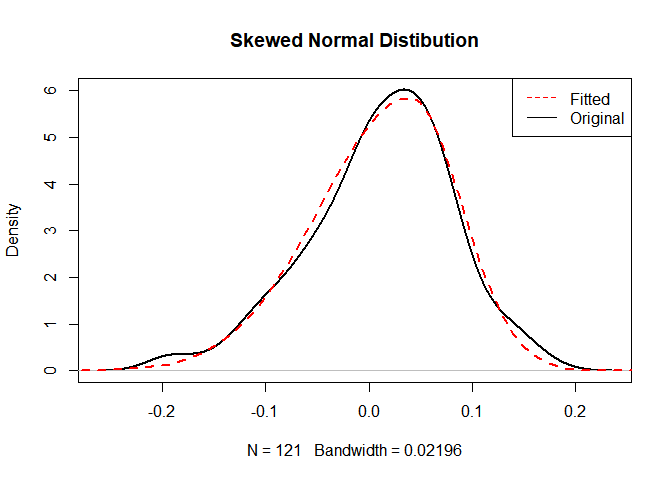<!-- -->

#### *Student’s T Distribution*

``` r
BLK_t=fitdistr(x1,"t")
BLK_para_t <- BLK_t$estimate

AIC_BLK_t <- 2*(2)-(2*(BLK_t$loglik))
BIC_BLK_t <- -2*(BLK_t$loglik)+(log(length(x1))*2)
```

``` r
plot(density(x1),lwd =2, main = "Student's T Distibution", col = "black")
lines(x,dstd(x,mean = BLK_para_t[1],sd = BLK_para_t[2], nu = BLK_para_t[3]),lwd = 2,lty = 2,col="red")
legend(x = "topright",legend = c("Fitted","Original"),col=c("red","black"), lty = c(2,1))
```

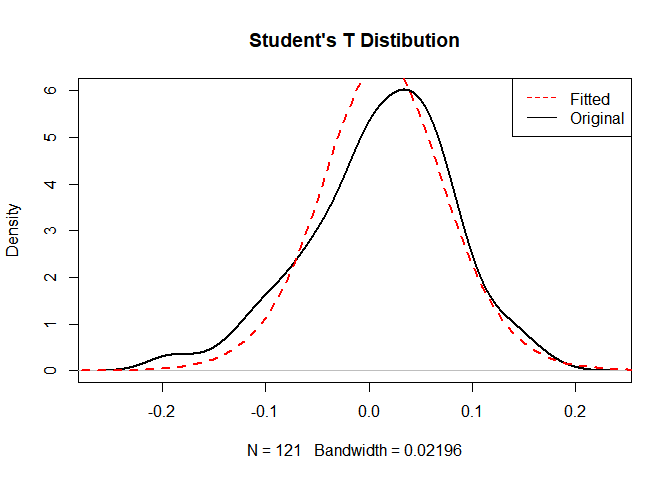<!-- -->

#### *Skewed Student’s T Distribution*

``` r
BLK_st=sstdFit(x1)
BLK_para_st <- BLK_st$estimate

AIC_BLK_st <- 2*(2)-(2*(-BLK_st$minimum))
BIC_BLK_st <- -2*(-BLK_st$minimum)+(log(length(x1))*2)
```

``` r
plot(density(x1),lwd =2, main = "Skewed Student's T Distibution", col = "black")
lines(x,dsstd(x,mean = BLK_para_st[1],sd = BLK_para_st[2], nu = BLK_para_st[3],xi = BLK_para_st[4]),lwd = 2,lty = 2,col="red")
legend(x = "topright",legend = c("Fitted","Original"),col=c("red","black"), lty = c(2,1))
```

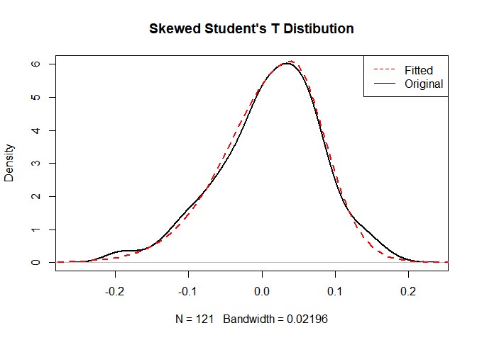<!-- -->

##### Table 1.

``` r
## creating table to store estimators
BLK_goodness<-matrix(nrow = 4, ncol = 2)
BLK_goodness[1,]=c(AIC_BLK_n,BIC_BLK_n)
BLK_goodness[2,]=c(AIC_BLK_sn,BIC_BLK_sn) 
BLK_goodness[3,]=c(AIC_BLK_t,BIC_BLK_t) 
BLK_goodness[4,]=c(AIC_BLK_st,BIC_BLK_st) 
BLK_goodness<-data.frame(BLK_goodness)
names<-c("Normal", "Skewed Normal", "Student T", "Skewed Student T")

row.names(BLK_goodness) <- names
names(BLK_goodness) <- c("AIC","BIC")
BLK_goodness<-round(BLK_goodness,2)

htmlTable(BLK_goodness, caption = "BlackRock Fitting Results")
```

<table class="gmisc_table" style="border-collapse: collapse; margin-top: 1em; margin-bottom: 1em;">
<thead>
<tr>
<td colspan="3" style="text-align: left;">
BlackRock Fitting Results
</td>
</tr>
<tr>
<th style="border-bottom: 1px solid grey; border-top: 2px solid grey;">
</th>
<th style="font-weight: 900; border-bottom: 1px solid grey; border-top: 2px solid grey; text-align: center;">
AIC
</th>
<th style="font-weight: 900; border-bottom: 1px solid grey; border-top: 2px solid grey; text-align: center;">
BIC
</th>
</tr>
</thead>
<tbody>
<tr>
<td style="text-align: left;">
Normal
</td>
<td style="text-align: center;">
-297.88
</td>
<td style="text-align: center;">
-292.29
</td>
</tr>
<tr>
<td style="text-align: left;">
Skewed Normal
</td>
<td style="text-align: center;">
-302.8
</td>
<td style="text-align: center;">
-297.2
</td>
</tr>
<tr>
<td style="text-align: left;">
Student T
</td>
<td style="text-align: center;">
-298.44
</td>
<td style="text-align: center;">
-292.85
</td>
</tr>
<tr>
<td style="border-bottom: 2px solid grey; text-align: left;">
Skewed Student T
</td>
<td style="border-bottom: 2px solid grey; text-align: center;">
-303.1
</td>
<td style="border-bottom: 2px solid grey; text-align: center;">
-297.51
</td>
</tr>
</tbody>
</table>

### <u>Goldman Sachs:</u>

#### *Normal Distribution*

``` r
GS_n<-fitdistr(x2,"normal")
GS_para_n <- GS_n$estimate

AIC_GS_n <- 2*(2)-(2*(GS_n$loglik))
BIC_GS_n <- -2*(GS_n$loglik)+(log(length(x2))*2)
```

``` r
plot(density(x2),lwd =2, main = "Normal Distribution", col = "black")
lines(x,dnorm(x,mean = GS_para_n[1],sd = GS_para_n[2]),lwd = 2,lty = 2,col="red")
legend(x = "topright",legend = c("Fitted","Original"),col=c("red","black"), lty = c(2,1))
```

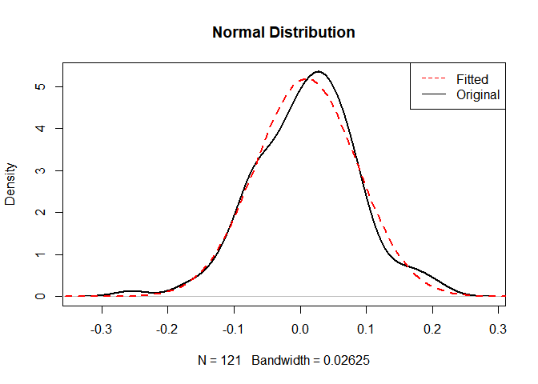<!-- -->

#### *Skewed Normal Distribution*

``` r
GS_sn <- snormFit(x2)
GS_para_sn <- GS_sn$par


AIC_GS_sn <- 2*(2)-(2*(-GS_sn$objective))
BIC_GS_sn <- -2*(-GS_sn$objective)+(log(length(x2))*2)
```

``` r
plot(density(x2),lwd =2, main = "Skewed Normal Distibution", col = "black")
lines(x,dsnorm(x,mean = GS_para_sn[1],sd = GS_para_sn[2],xi = GS_para_sn[3]),lwd = 2,lty = 2,col="red")
legend(x = "topright",legend = c("Fitted","Original"),col=c("red","black"), lty = c(2,1))
```

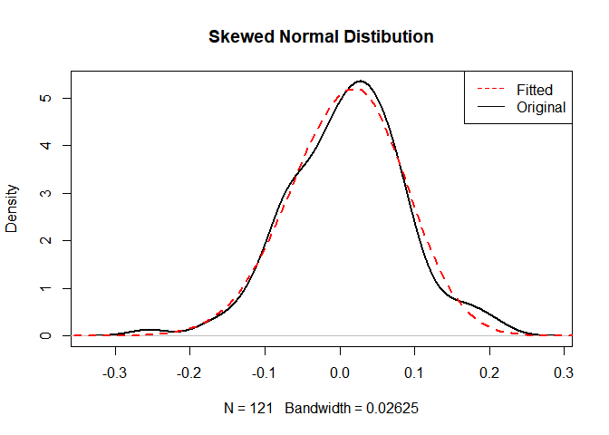<!-- -->

#### *Student T Distribution*

``` r
plot(density(x2),lwd =2, main = "Student's T Distibution", col = "black")
lines(x,dstd(x,mean = GS_para_t[1],sd = GS_para_t[2], nu = GS_para_t[3]),lwd = 2,lty = 2,col="red")
legend(x = "topright",legend = c("Fitted","Original"),col=c("red","black"), lty = c(2,1))
```

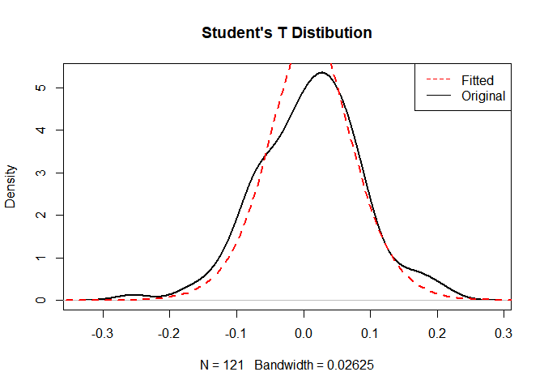<!-- -->

#### *Skewed Student T Distribution*

``` r
GS_st=sstdFit(x2)
GS_para_st <- GS_st$estimate

AIC_GS_st <- 2*(2)-(2*(-GS_st$minimum))
BIC_GS_st <- -2*(-GS_st$minimum)+(log(length(x2))*2)
```

``` r
plot(density(x2),lwd =2, main = "Skewed Student's T Distibution", col = "black")

lines(x,dsstd(x,mean = GS_para_st[1],sd = GS_para_st[2], nu = GS_para_st[3],xi = GS_para_st[4]),lwd = 2,lty = 2,col="red")

legend(x = "topright",legend = c("Fitted","Original"),col=c("red","black"), lty = c(2,1))
```

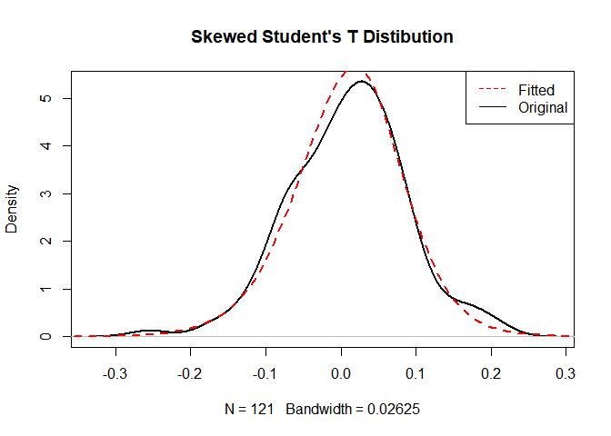<!-- -->

##### Table 2.

<table class="gmisc_table" style="border-collapse: collapse; margin-top: 1em; margin-bottom: 1em;">
<thead>
<tr>
<td colspan="3" style="text-align: left;">
Goldman Sachs Fitting Results
</td>
</tr>
<tr>
<th style="border-bottom: 1px solid grey; border-top: 2px solid grey;">
</th>
<th style="font-weight: 900; border-bottom: 1px solid grey; border-top: 2px solid grey; text-align: center;">
AIC
</th>
<th style="font-weight: 900; border-bottom: 1px solid grey; border-top: 2px solid grey; text-align: center;">
BIC
</th>
</tr>
</thead>
<tbody>
<tr>
<td style="text-align: left;">
Normal
</td>
<td style="text-align: center;">
-274.03
</td>
<td style="text-align: center;">
-268.44
</td>
</tr>
<tr>
<td style="text-align: left;">
Skewed Normal
</td>
<td style="text-align: center;">
-274.56
</td>
<td style="text-align: center;">
-268.97
</td>
</tr>
<tr>
<td style="text-align: left;">
Student T
</td>
<td style="text-align: center;">
-275.79
</td>
<td style="text-align: center;">
-270.2
</td>
</tr>
<tr>
<td style="border-bottom: 2px solid grey; text-align: left;">
Skewed Student T
</td>
<td style="border-bottom: 2px solid grey; text-align: center;">
-276.26
</td>
<td style="border-bottom: 2px solid grey; text-align: center;">
-270.67
</td>
</tr>
</tbody>
</table>

##### Table 3.

<table class="gmisc_table" style="border-collapse: collapse; margin-top: 1em; margin-bottom: 1em;">
<thead>
<tr>
<td colspan="3" style="text-align: left;">
Skewed T Optimal Parameters
</td>
</tr>
<tr>
<th style="border-bottom: 1px solid grey; border-top: 2px solid grey;">
</th>
<th style="font-weight: 900; border-bottom: 1px solid grey; border-top: 2px solid grey; text-align: center;">
BLK
</th>
<th style="font-weight: 900; border-bottom: 1px solid grey; border-top: 2px solid grey; text-align: center;">
GS
</th>
</tr>
</thead>
<tbody>
<tr>
<td style="text-align: left;">
Location: mean
</td>
<td style="text-align: center;">
0.0112
</td>
<td style="text-align: center;">
0.0096
</td>
</tr>
<tr>
<td style="text-align: left;">
Scale: sd
</td>
<td style="text-align: center;">
0.0695
</td>
<td style="text-align: center;">
0.0769
</td>
</tr>
<tr>
<td style="text-align: left;">
Shape: nu
</td>
<td style="text-align: center;">
19.2245
</td>
<td style="text-align: center;">
9.945
</td>
</tr>
<tr>
<td style="border-bottom: 2px solid grey; text-align: left;">
Skewness: xi
</td>
<td style="border-bottom: 2px solid grey; text-align: center;">
0.7578
</td>
<td style="border-bottom: 2px solid grey; text-align: center;">
0.9151
</td>
</tr>
</tbody>
</table>

## b. Copulas

``` r
###### uniform marginal distributions for skewed t
u1<-psstd(x1,mean = BLK_para_st[1],sd = BLK_para_st[2],nu = BLK_para_st[3],xi = BLK_para_st[4])

u2<-psstd(x2,mean = GS_para_st[1],sd = GS_para_st[2],nu = GS_para_st[3],xi = GS_para_st[4])
cor(x1,x2)
```

    ## [1] 0.6753741

``` r
cor(u1,u2)
```

    ## [1] 0.69243

##### Uniform Distribution Figures

``` r
hist(u1,probability = TRUE,col = "#00AFBB",main = "BlackRock Uniform Transformation")
```

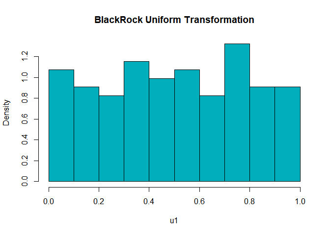<!-- -->

``` r
hist(u2,probability = TRUE,col = "#E7B800",main = "Goldman Sachs Uniform Transformation")
```

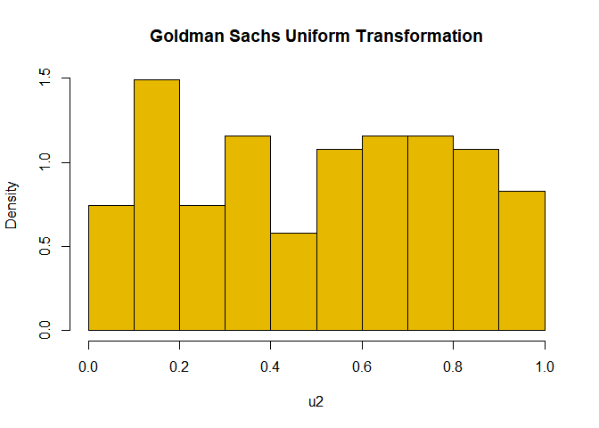<!-- -->

``` r
U.hat<-cbind(u1,u2)
### Non-Parametric Density estimation plot
fhatU=kde(x=U.hat,H=Hscv(x=U.hat))
plot(fhatU,cont=seq(10,80,10), main = "Contour plot",xlab = "BlackRock Returns", ylab = "Goldman Sachs Returns")
points(u1,u2, col = "lightcyan3",pch =20)
```

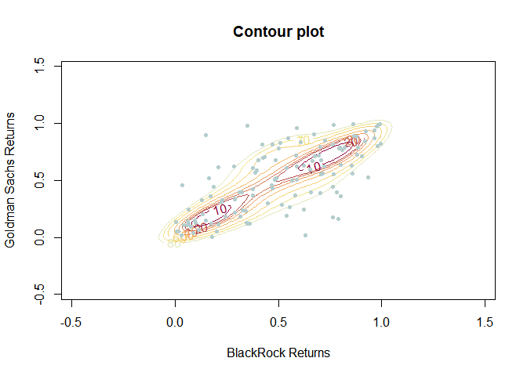<!-- -->

``` r
## Stock Correlations
tau=cor.test(as.numeric(u1),as.numeric(u2),method="kendall")$estimate
r=cor.test(as.numeric(u1),as.numeric(u2),method="pearson")$estimate
## estimator for spearman's rho used in copulas
omega=sin((tau*pi)/2)
```

##### Table 4.

<table class="gmisc_table" style="border-collapse: collapse; margin-top: 1em; margin-bottom: 1em;">
<thead>
<tr>
<td colspan="2" style="text-align: left;">
Correlation Table of Marginal Returns
</td>
</tr>
<tr>
<th style="border-bottom: 1px solid grey; border-top: 2px solid grey;">
</th>
<th style="font-weight: 900; border-bottom: 1px solid grey; border-top: 2px solid grey; text-align: center;">
Value
</th>
</tr>
</thead>
<tbody>
<tr>
<td style="text-align: left;">
Kendall
</td>
<td style="text-align: center;">
0.51
</td>
</tr>
<tr>
<td style="text-align: left;">
Pearson
</td>
<td style="text-align: center;">
0.69
</td>
</tr>
<tr>
<td style="border-bottom: 2px solid grey; text-align: left;">
Spearman
</td>
<td style="border-bottom: 2px solid grey; text-align: center;">
0.72
</td>
</tr>
</tbody>
</table>

Marginal relationship appears strong between BlackRock and Goldman
Sachs.

#### *Gaussian Copula*

``` r
Cgauss <- fitCopula(copula=normalCopula(dim=2),data=U.hat,method="ml",start=c(omega))
guass_para<-coef(Cgauss)

guass_loglike <- loglikCopula(param=guass_para,u=U.hat,copula=normalCopula(dim=2))
guass_AIC <- -2*guass_loglike + 2*length(guass_para)
```

#### *T - Copula*

``` r
Ct<-fitCopula(copula=tCopula(dim=2),data=U.hat,method="ml",start=c(omega,10))
t_para<-coef(Ct)

t_loglik<-loglikCopula(param=t_para,u=U.hat,copula=tCopula(dim=2))
t_AIC<- -2*t_loglik + 2*length(t_para)
```

#### *Frank Copula*

``` r
Cfr <- fitCopula(copula=frankCopula(1,dim=2),data=U.hat,method="ml")
fr_para<-coef(Cfr)

fr_loglik <- loglikCopula(param=fr_para,u=U.hat,copula=frankCopula(dim=2))
fr_AIC <- -2*fr_loglik + 2*length(fr_para)
```

#### *Joe Copula*

``` r
Cjoe <- fitCopula(copula=joeCopula(dim=2),data=U.hat,method="ml")
joe_para<-coef(Cjoe)

joe_loglik <- loglikCopula(param=joe_para,u=as.matrix(U.hat),copula=joeCopula(dim=2)) 
joe_AIC <- -2*joe_loglik + 2*length(joe_para)
```

#### *Gumbel Copula*

``` r
Cgum <- fitCopula(copula=gumbelCopula(dim=2),data=U.hat,method="ml",start=1) 
gum_para<-coef(Cgum)

gum_loglik <- loglikCopula(param=gum_para,u=as.matrix(U.hat),copula=gumbelCopula(dim=2)) 
gum_AIC <- -2*gum_loglik + 2*length(gum_para)
```

##### Table 5.

<table class="gmisc_table" style="border-collapse: collapse; margin-top: 1em; margin-bottom: 1em;">
<thead>
<tr>
<td colspan="2" style="text-align: left;">
Copula Results
</td>
</tr>
<tr>
<th style="border-bottom: 1px solid grey; border-top: 2px solid grey;">
</th>
<th style="font-weight: 900; border-bottom: 1px solid grey; border-top: 2px solid grey; text-align: center;">
AIC
</th>
</tr>
</thead>
<tbody>
<tr>
<td style="text-align: left;">
Guassian
</td>
<td style="text-align: center;">
-75.61
</td>
</tr>
<tr>
<td style="text-align: left;">
T
</td>
<td style="text-align: center;">
-76.13
</td>
</tr>
<tr>
<td style="text-align: left;">
Frank
</td>
<td style="text-align: center;">
-78.08
</td>
</tr>
<tr>
<td style="text-align: left;">
Joe
</td>
<td style="text-align: center;">
-53.72
</td>
</tr>
<tr>
<td style="border-bottom: 2px solid grey; text-align: left;">
Gumbel
</td>
<td style="border-bottom: 2px solid grey; text-align: center;">
-71.81
</td>
</tr>
</tbody>
</table>

## c. Simulated Sample

``` r
#generate a random sample with size n from the fitted frank copula
Sim_prob<- rCopula(copula=frankCopula(param = fr_para),n=length(x1))
Sim_prob <-data.frame(Sim_prob)
names(Sim_prob)<-c("BLK","GS")

#transform marginals into the estimated skewed t
Sim_BLK <- qsstd(Sim_prob[,1],mean = BLK_para_st[1],sd = BLK_para_st[2],nu = BLK_para_st[3],xi = BLK_para_st[4])

Sim_GS <- qsstd(Sim_prob[,2],mean = GS_para_st[1],sd = GS_para_st[2],nu = GS_para_st[3],xi = GS_para_st[4])
```

``` r
plot(Sim_BLK,Sim_GS, main = "Simulated Monthly Returns" ,xlim = c(-0.2,0.2), pch =18, col = "darkgreen", xlab = "BlackRock ", ylab = "Goldman Sachs")
```

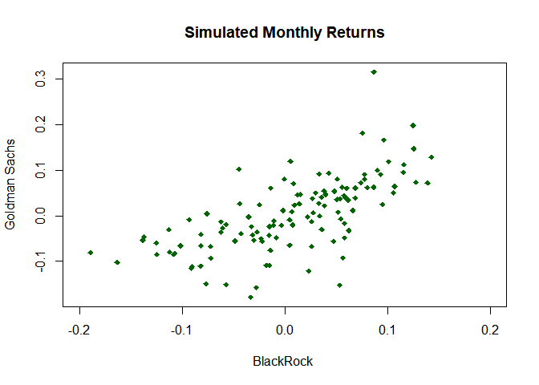<!-- -->

``` r
plot(x1,x2, main = "Original Monthly Returns",xlim = c(-0.2,0.20) ,pch =18, col = "black", xlab = "BlackRock ", ylab = "Goldman Sachs")
```

<!-- -->

``` r
plot(xd1,xd2, main = "Original Daily Returns" , pch =18,xlim = c(-0.2,0.20), col = "black", xlab = "BlackRock ", ylab = "Goldman Sachs")
```

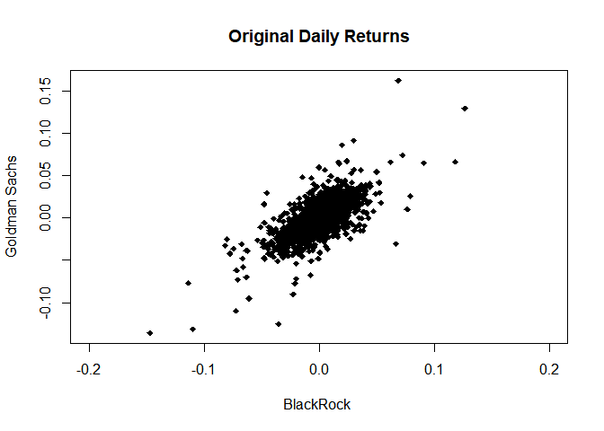<!-- -->

# 3. Conclusion

The results of the simulated monthly returns appear to be close to the
actual monthly log returns. Therefore, Blackrock and Goldman Sachs have
a dependent relationship since their simulated monthly log returns
maintains their joint relationship. However, the simulated log returns
and original log returns do not appear to closely match the distribution
of daily log returns (clustered more in the center). This is not
surprising considering that the daily log returns appear to have smaller
values in comparison due to the short time period between its returns.
Its variance would most likely be smaller as a result as well. It is
important to note also that the positive relationship between BlackRock
and Goldman Sachs returns is still maintained graphically even when
daily.
